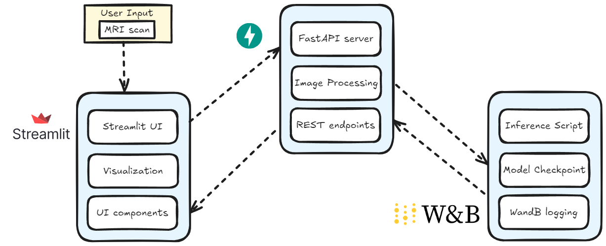

<!-- omit in toc -->
# MRI Brain Tumor Segmentation (Rudimentary) System
<!-- omit in toc -->
## Table of Contents
- [Overview](#overview)
- [System Architecture](#system-architecture)
- [Repository Structure](#repository-structure)
- [Features](#features)
  - [API Layer](#api-layer)
  - [Observability Stack](#observability-stack)
  - [Models](#models)
  - [Artifacts](#artifacts)
  - [WandB](#wandb)
- [Installation Guide](#installation-guide)
  - [Prerequisites](#prerequisites)
  - [Step 1: Clone the Repository](#step-1-clone-the-repository)
  - [Step 2: Create a Virtual Environment](#step-2-create-a-virtual-environment)
  - [Step 3: Install Dependencies](#step-3-install-dependencies)
  - [Step 4: Download Model Checkpoint](#step-4-download-model-checkpoint)
- [Running the Application](#running-the-application)
  - [Start the API Server](#start-the-api-server)
  - [Start the Streamlit Frontend](#start-the-streamlit-frontend)
- [Usage Guide](#usage-guide)
- [Resources](#resources)
- [Troubleshooting](#troubleshooting)

## Overview
A comprehensive solution for brain tumor segmentation using deep learning, featuring a FastAPI backend and Streamlit frontend. A main feature of this pipeline is the visualization of segmentation overlay between end-user's input MRI scans and model prediction across 4 modalities of MRI scans. As of now, the project can only run on local laptop, and one of the future directions is leverage this system onto cloud platforms.

### System Architecture
The system architecture diagram below illustrates the main components and their interactions:



## Repository Structure
```
.
├── api/                                # Brain Tumor Segmentation FastAPI 
├── frontend/                           # Streamlit user interface
│   ├── components/                     # frontend utility functions
│   └── pages/                          # Landing page
├── models/                             # Inference script
├── artifacts/                          # Model checkpoint
├── Wandb/                              # WandB logging
├── Notebooks/                          # Training notebooks
├── requirements.txt                    # required libraries
```

## Features

### API Layer
- **FastAPI-based backend** service for brain tumor segmentation
- Handles **image processing** and **runs inference** on the trained model
- Provides **RESTful endpoints** for the frontend to interact with

### Interactive Frontend
- **Streamlit-based user interface** for uploading brain MRI scans (compatible with Medical Segmentation Decathlon competition)
- **Visualizes** the input data and prediction segmentation overlay 
- Contains **utility components and page layouts**

### Models
- Stores the trained model checkpoint
- Contains weights and parameters for the segmentation model

### Artifacts
- Contains the inference script for the segmentation model
- Implements the model architecture and prediction logic

### WandB
- Weights & Biases integration for experiment tracking
- Logs training metrics, model performance, and hyperparameters

## Installation Guide

### Prerequisites

### Step 1: Clone the Repository
```bash
git clone https://github.com/duongmaixa1207/brain-tumor-segmentation.git
cd brain-tumor-segmentation
```

### Step 2: Create a Virtual Environment
```bash
python -m venv venv
```
Activate the virtual environment:
**On Windows:**
```bash
venv\Scripts\activate
```
**On macOS and Linux**:
```bash
source venv/bin/activate
```
### Step 3: Install Dependencies
```bash
pip install -r requirements.txt
```

### Step 4: Download Model Checkpoint
The model checkpoint should be stored in the artifacts/ directory. If not included in the repository, download it from the link provided in the Resources section.

## Running the Application

### Start the API Server
```bash
uvicorn api.main:app --reload --host 0.0.0.0 --port 8000
```

### Start the Streamlit Frontend
Open a new terminal window, navigate to the project directory, and run:
```bash
streamlit run frontend/app.py
```
The application should now be accessible at http://localhost:8501

## Usage Guide

- Open the Streamlit application in your web browser
- Upload a brain MRI scan in the supported format (nii.gz)
- Click the "Process" button to initiate segmentation
- View the results showing the original scan with segmented tumor regions

## Resources

Demo Video - Watch a demonstration of the system
 - Access the dataset used for training

## Troubleshooting
**Issue**: The API server fails to start.
**Solution**: Check if the required port (8000) is already in use. Try a different port using --port flag.

**Issue**: GPU not detected for inference.
**Solution**: Ensure CUDA and appropriate GPU drivers are installed. The system will fall back to CPU inference if GPU is unavailable.

**Issue**: Memory error during inference.
**Solution**: Restart the session. If not, Reduce the batch size in the configuration or use a device with more memory.